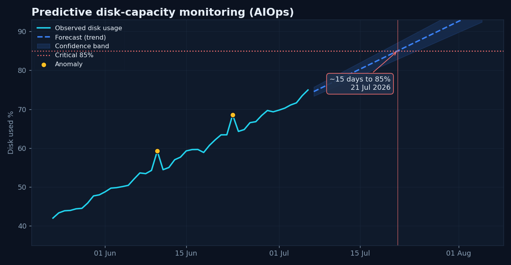

# aiops-forecaster

**Predictive infrastructure monitoring** — a small AIOps tool that forecasts *when*
a server's disk will cross a critical threshold (default **85%**) and flags
**anomalies** in the usage history. The idea: **predict and prevent**, instead of
only reacting to alerts after the fact.



It fits a trend to the usage history, projects it forward with a confidence band,
reports the estimated breach date, and highlights points that deviate from the
trend (residual > 3σ) as anomalies.

---

## Why this exists

Standard monitoring alerts you *after* a disk hits 85%. This adds the missing
half: a model that says **"this disk will be full in ~15 days"** so capacity can
be planned before anything breaks — the core idea behind **AIOps** (AI for IT
operations). It pairs directly with the Prometheus/Grafana monitoring stack in my
[lab-monitoring](https://github.com/alikamkar98/lab-monitoring) repo.

## What it does

- **Forecast** — linear trend fit + forward projection with a widening confidence band.
- **Time-to-threshold** — estimated date the disk reaches the critical level.
- **Anomaly detection** — flags samples whose residual from the trend exceeds 3σ.
- **Dark-themed chart** — history + forecast + threshold + predicted crossing + anomalies.

## Run it

```bash
pip install -r requirements.txt
python forecast_disk.py                 # runs on a representative demo series
python forecast_disk.py --threshold 90  # custom threshold
```

Example output:

```
Latest usage       : 74.9%
Growth rate (trend): 0.72% per day
Anomalies detected : 2
Predicted 85% breach: 2026-07-21  (~15 days)
```

## Live data (Grafana Cloud / Prometheus)

The tool also queries a real Prometheus endpoint. Set the environment variables
and pass `--source prometheus`:

```bash
export GRAFANA_PROM_URL=https://<stack>.grafana.net/api/prom
export GRAFANA_PROM_USER=<prometheus-user-id>
export GRAFANA_PROM_TOKEN=<grafana-cloud-token>
python forecast_disk.py --source prometheus --days 30
```

It runs the same PromQL used by my monitoring dashboard
(`100 - node_filesystem_avail_bytes/…`). The bundled chart uses a representative
disk-fill scenario so the forecast is meaningful even on a lab server whose own
disk is stable.

## How it maps to a real ops workflow

1. Monitoring (Prometheus/Grafana) collects the metrics.
2. This forecaster runs on a schedule and predicts the breach date.
3. The prediction feeds capacity planning / a ticket — before the outage.

## License

MIT
